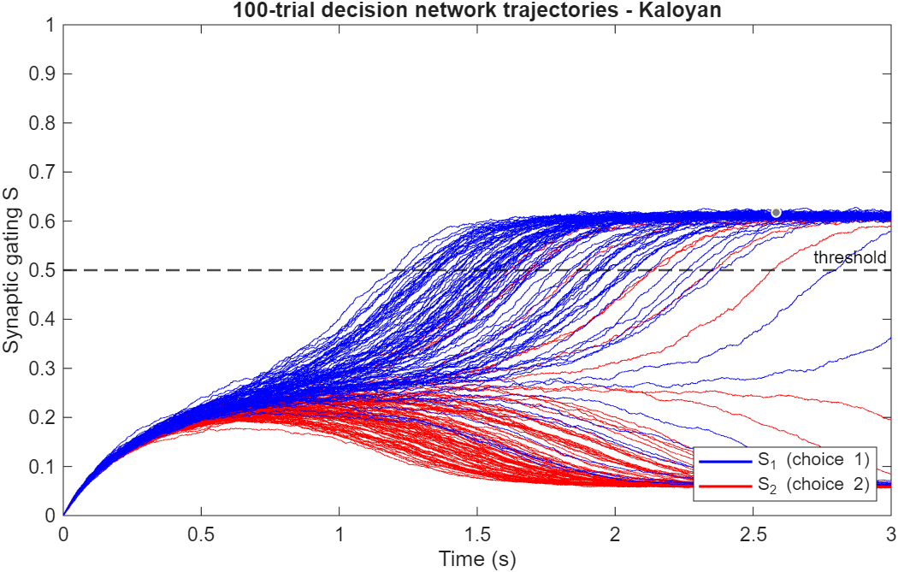
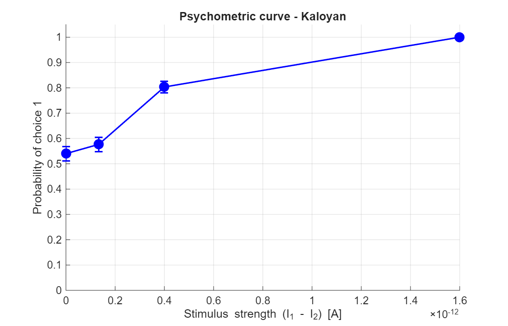
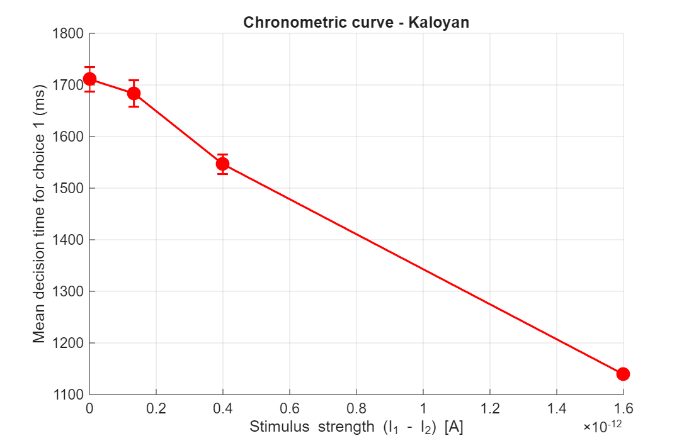
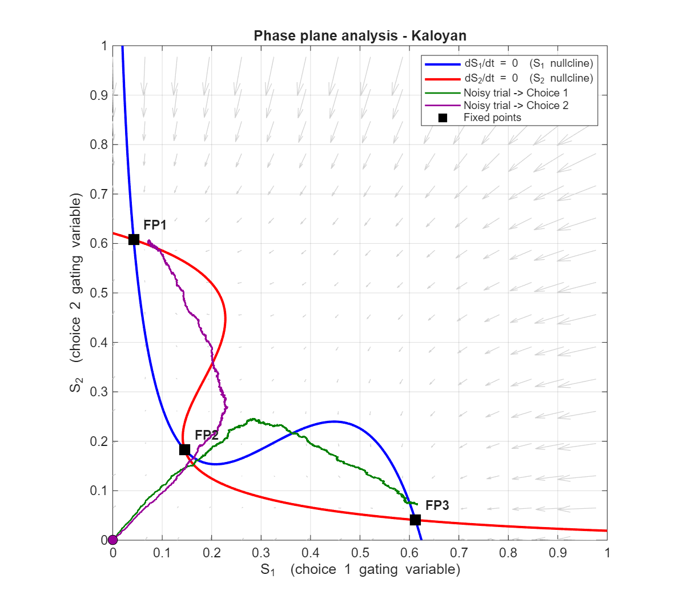
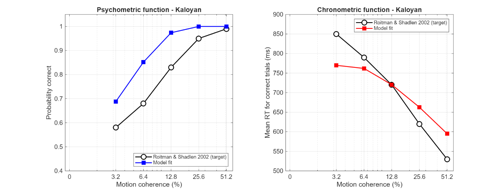

# Attractor Dynamics in a Two-Population Cortical Decision Network

A MATLAB implementation and analysis of a reduced recurrent cortical decision-making network, developed as an MSc Cortical Modelling mini-project.

**Original assessment mark: 87/100.**

The project studies how recurrent self-excitation, mutual inhibition and noisy sensory evidence can produce categorical choices, reaction-time distributions, psychometric functions and attractor dynamics. It then compares the model with behavioural data reported by Roitman and Shadlen (2002).

> This repository is a portfolio archive of completed assessed work. The university assignment brief and marked submission are deliberately not reproduced here.

## Scientific idea

The network contains two competing neural populations. Each population receives:

- an external evidence current;
- recurrent self-excitation;
- inhibition from the competing population.

The reduced dynamics follow the Wong–Wang family of decision models. Each population is represented by a synaptic gating variable, with coupled dynamics

```math
\begin{aligned}
\frac{dS_1}{dt}
&=
-\frac{S_1}{\tau}
+
(1-S_1)\gamma r_1, \\[6pt]
\frac{dS_2}{dt}
&=
-\frac{S_2}{\tau}
+
(1-S_2)\gamma r_2.
\end{aligned}
```
The firing rate of each population is determined by the nonlinear current-to-rate transfer function

```math
r_i = H(x_i)
=
\frac{x_i}{1-\exp(-d x_i)},
\qquad
x_i=aI_{\mathrm{syn},i}-b,
\qquad i\in\{1,2\}.
```
The total synaptic currents combine recurrent self-excitation, cross-population inhibition, external evidence and stochastic input:

```math
\begin{aligned}
I_{\mathrm{syn},1}
&=
W_{11}S_1
-
W_{12}S_2
+
I_1
+
\sigma\xi_1, \\[6pt]
I_{\mathrm{syn},2}
&=
W_{22}S_2
-
W_{21}S_1
+
I_2
+
\sigma\xi_2.
\end{aligned}
```
Equivalently, the synaptic-current system can be written compactly as

```math
\begin{bmatrix}
I_{\mathrm{syn},1} \\
I_{\mathrm{syn},2}
\end{bmatrix}
=
\begin{bmatrix}
W_{11} & -W_{12} \\
-W_{21} & W_{22}
\end{bmatrix}
\begin{bmatrix}
S_1 \\
S_2
\end{bmatrix}
+
\begin{bmatrix}
I_1 \\
I_2
\end{bmatrix}
+
\sigma
\begin{bmatrix}
\xi_1 \\
\xi_2
\end{bmatrix}.
```
The stochastic inputs are independent standard Gaussian samples,

```math
\xi_1,\xi_2 \sim \mathcal{N}(0,1).
```
Here, $S_1,S_2$ are the synaptic gating variables, $r_1,r_2$ are the corresponding firing rates, $W_{11},W_{22}$ represent recurrent self-excitation, $W_{12},W_{21}$ represent cross-population inhibition, $I_1,I_2$ are the external evidence currents, and $\sigma$ controls the amplitude of stochastic input fluctuations.

For the submitted analysis, a decision was defined when a gating variable first reached $S=0.5$. This interpretation was chosen because the assignment's example trajectory was expressed on the $S\in[0,1]$ scale and because the reduced Wong–Wang model is naturally written in terms of synaptic gating variables.

## Base-model parameters

| Parameter | Value | Role |
|---|---:|---|
| $\tau$ | 0.100 s | synaptic time constant |
| $\gamma$ | 0.641 | gating-rate scaling |
| $a$ | $270\times10^9$ | transfer-function scaling |
| $b$ | 108 | transfer-function offset |
| $d$ | 0.15 | transfer-function shape |
| $W_{11},W_{22}$ | $0.2609\times10^{-9}$ | recurrent excitation |
| $W_{12},W_{21}$ | $0.0497\times10^{-9}$ | cross-population inhibition |
| $\sigma$ | $0.03\times10^{-9}$ A | input-noise amplitude |
| threshold | 0.5 | decision threshold on $S$ |
| $dt$ | 0.1 ms | Euler integration step |
| $T$ | 3 s | simulation duration |

Default evidence currents were $I_1=0.3310\times10^{-9}$ A and $I_2=0.3304\times10^{-9}$ A.

## Analyses

### 1. Noisy decision trajectories

One hundred stochastic trials were simulated using forward Euler integration. The slight evidence advantage for population 1 biases the network toward Choice 1, but noise still allows some trials to fall into the competing attractor.



**Submitted result:** Choice 1 won 89/100 trials. Across those Choice-1 trials, mean decision time was **1.504 s** (median 1.443 s; SD 0.257 s).

### 2. Psychometric relationship

Stimulus strength was defined as

```math
\Delta I = I_1-I_2.
```
while keeping the mean input fixed. A grid of stimulus strengths was evaluated with 300 trials per level.

The submitted target-matching analysis reported:

| Target $P(\mathrm{Choice\ 1})$ | Selected stimulus strength | Observed probability |
|---:|---:|---:|
| 50% | $0$ A | 54.0% |
| 60% | $1.33\times10^{-13}$ A | 57.7% |
| 80% | $4.00\times10^{-13}$ A | 80.3% |
| 100% | $1.60\times10^{-12}$ A | 100.0% |

Error bars are binomial standard errors.



### 3. Chronometric relationship

Decision time falls as the evidence difference increases: stronger evidence pushes the system away from the decision boundary more rapidly.



### 4. Phase-plane and attractor analysis

Nullclines were obtained numerically from the zero level sets of $dS_1/dt$ and $dS_2/dt$. Their intersections produced three fixed points:

- **FP1:** $(0.042,\ 0.608)$ — Choice-2 attractor
- **FP2:** $(0.145,\ 0.183)$ — saddle / decision boundary
- **FP3:** $(0.612,\ 0.041)$ — Choice-1 attractor

The two stable nodes represent committed decisions. The saddle separates their basins of attraction.



### 5. Analytical Jacobian stability analysis

The optional analytical extension derives the $2\times2$ Jacobian of the deterministic flow and evaluates its eigenvalues at each fixed point.

Submitted eigenvalues:

| Fixed point | Eigenvalues | Classification |
|---|---|---|
| FP1 | $-6.39,\ -9.90$ | stable node |
| FP2 | $-3.49,\ +0.74$ | saddle |
| FP3 | $-10.23,\ -6.56$ | stable node |

The real eigenvalues are consistent with non-oscillatory approach to the stable attractors.

### 6. Behavioural fit to Roitman & Shadlen (2002)

The base model produced decisions that were too slow relative to the monkey reaction-time data. Four biologically motivated extensions were introduced:

1. coherence-dependent external inputs with sensitivity $\kappa=0.03$;
2. a lower decision threshold $S_{\mathrm{thr}}=0.45$;
3. a fixed non-decision time $t_{\mathrm{nd}}=300$ ms;
4. increased input noise $\sigma=0.06\times10^{-9}$ A.

Five hundred trials were simulated at each of six motion-coherence levels.



The submitted analysis reproduced the main qualitative signatures: chance performance at zero coherence, increasing accuracy with coherence and decreasing reaction time with coherence. The chronometric fit was closer than the psychometric fit; intermediate-coherence accuracy was systematically over-predicted.

The reported combined error of **0.088** is a project-specific summary metric: accuracy MSE plus reaction-time MSE after scaling RT residuals by 200 ms. It should not be interpreted as a likelihood, $R^2$, or standard model-comparison statistic.

## Repository structure

```text
.
├── README.md
├── ACADEMIC_USE_NOTICE.md
├── .gitignore
├── figures/
│   ├── 01_trajectories.png
│   ├── 02_psychometric_curve.png
│   ├── 03_chronometric_curve.png
│   ├── 04_phase_plane.png
│   └── 05_roitman_shadlen_fit.png
├── src/
│   ├── simulate_trial.m
│   ├── Q1.m
│   ├── Q2.m
│   ├── Q3.m
│   ├── Q4.m
│   ├── Q5.m
│   ├── Q6.m
│   ├── Q7_phase_plane.m
│   ├── Q7_jacobian.m
│   └── Q8.m
└── docs/
    ├── ASSESSMENT_AND_TECHNICAL_NOTES.md
    └── REPRODUCIBILITY.md
```

## Running the code

Use MATLAB and place all files from `src/` on the MATLAB path.

Recommended execution order:

```text
Q1
Q2
Q3
Q4
Q5
Q6
Q7_phase_plane
Q7_jacobian
Q8
```

Dependencies:

- `Q1`–`Q6` call `simulate_trial.m`.
- `Q5` and `Q6` require `Q4_results.mat`, generated by `Q4.m`.
- `Q7_jacobian.m` requires `Q7_results.mat`, generated by `Q7_phase_plane.m`.
- `Q8.m` is self-contained.

The scripts use fixed random seeds for reproducibility. See [`docs/Reproducibility.md`](docs/Reproducibility.md) for important details about what is and is not guaranteed to reproduce exactly.

## Assessment context and post-assessment review

The project received **87/100**. Marker feedback was strongest on the phase-plane/Jacobian work and on the behavioural-fit presentation. The main deductions concerned threshold-crossing logic, numerical stability testing around the saddle, explanation of vector-field arrows, one plot-range choice and the behavioural fit at intermediate coherences.

A separate technical review also identifies two issues worth correcting in a future revision:

- `Q1.m` consumes one stochastic trial only to obtain the time-vector size, so its displayed 100 trials are not exactly the same 100-trial sequence used by `Q2.m`/`Q3.m`, despite the comment suggesting they are.
- `Q8.m` uses a logarithmic coherence axis while the data vector contains 0% coherence. The 0% point is therefore not actually plotted at its true x-coordinate; a public-facing revision should use a linear axis or an explicit transformed coordinate.

See [`docs/Assessment_and_Technical_Notes.md`](docs/Assessment_and_Technical_Notes.md).

## References

Britten, K. H., Shadlen, M. N., Newsome, W. T., & Movshon, J. A. (1993). Responses of neurons in macaque MT to stochastic motion signals. *Visual Neuroscience, 10*(6), 1157–1169. https://doi.org/10.1017/S0952523800010269

Cohen, M. R., & Kohn, A. (2011). Measuring and interpreting neuronal correlations. *Nature Neuroscience, 14*(7), 811–819. https://doi.org/10.1038/nn.2842

Hanks, T., Kiani, R., & Shadlen, M. N. (2014). A neural mechanism of speed-accuracy tradeoff in macaque area LIP. *eLife, 3*, e02260. https://doi.org/10.7554/eLife.02260

Huk, A. C., & Shadlen, M. N. (2005). Neural activity in macaque parietal cortex reflects temporal integration of visual motion signals during perceptual decision making. *Journal of Neuroscience, 25*(45), 10420–10436. https://doi.org/10.1523/JNEUROSCI.4684-04.2005

Roitman, J. D., & Shadlen, M. N. (2002). Response of neurons in the lateral intraparietal area during a combined visual discrimination reaction time task. *Journal of Neuroscience, 22*(21), 9475–9489. https://doi.org/10.1523/JNEUROSCI.22-21-09475.2002

Wong, K.-F., & Wang, X.-J. (2006). A recurrent network mechanism of time integration in perceptual decisions. *Journal of Neuroscience, 26*(4), 1314–1328. https://doi.org/10.1523/JNEUROSCI.3733-05.2006

